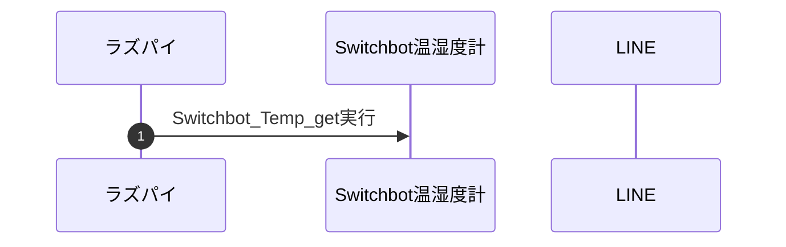

# RaspberrypiTempNotification

## 1. 作成物
ラズパイを使用して室内温度をLINEで通知する

## 2. 使用
 - Raspberrypi4
 - SwitchBot温湿度計

## 3.シーケンス

```mermaid
   sequenceDiagram
        autonumber
        participant ラズパイ
        participant Switchbot温湿度計
        participant LINE
        ラズパイ->>Switchbot温湿度計: Switchbot_Temp_get実行
        
```

##
